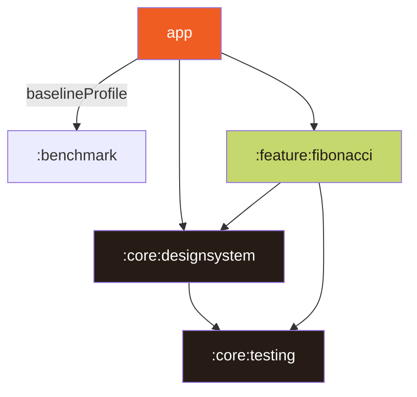

# Adibide

Adibide -_example in the basque language_- is the name of my take home assignment for Q42. Built
using __Android Compose__ and following Google's opinionated architecture showcased on their [Now in Android](https://github.com/android/nowinandroide) app. Hope you like it!

## How to try it

Download the [apk](./adibide_0.1.apk) from the repo or build the project normally! 🌱 ✨

## Implementation

For this challenge I've tried to use very modern android development architecture and components,
not only for showcasing that I can adapt to new frameworks and technologies but also for my own
experimentation and seeing what's next to come. 

For that, as the base for the UI, I have used Jetpack Compose (with the State Hoisting pattern for
the State Management) and Material 3 (including dynamic theming & themed icon). It also uses the Splashcreen API to offer a unified splashscreen for all android versions & it's localised to both Dutch and English (w/ Android +13's per-app language preference options).

For the architecture side of things, I've tried to separate the things by modularizing the app in order to make it as maintenable as possible and easy to add new functionality as the needs arise (plus those build speed gains ⚡️). In order to do so, a `build-logic` folder has been set-up with the needed convention plugins. Besides, _Adibide_ follows a MVVM pattern with Hilt for Dependency Injection and state flows as the source of truth for the UI. It also has a base profile for a fast initial load in fresh installations.

## Assignment

I've been able to implement the required Fibonacci game, with the 50x50 board & the needed logic to clear the fibonacci sequences when +5 of them are next to each other. That logic can be found in the [`FibonacciUtils#isFibonacciSequence`](./feature/fibonacci/src/main/kotlin/xyz/izadi/adibide/feature/fibonacci/FibonacciUtils.kt) as well as [`FibonacciViewModel#processMove`](./feature/fibonacci/src/main/kotlin/xyz/izadi/adibide/feature/fibonacci/FibonacciViewModel.kt) (note that I had some doubts on how this should be done as specified in the comment there).

Since the board is huge (2.500 cells!) I found that scrolling through it decently challenging and thus, I thought it could be a good idea to have a minimap to show where in the board we are looking at, as well as be able to go to different parts of the board fastly.

I also thought that having some kind of scoring system would make the game more fun, so despite not having any instructions on how this scoring would work like, I simply added up the totals of the aligned fibonacci sequence numbers.

## Testing

I've tried unit testing as much as the time allowed but I wish I had had more time for this. I mainly focused on the data manipulation part (fibonacci sequence detection) and got 100% coverage in the relevant [`FibonacciUtils`](./feature/fibonacci/src/main/kotlin/xyz/izadi/adibide/feature/fibonacci/FibonacciUtils.kt) and [`FibonacciViewModel`](./feature/fibonacci/src/main/kotlin/xyz/izadi/adibide/feature/fibonacci/FibonacciViewModel.kt) files.

For integration tests, I didn't have much time, but I wrote a sample one to showcase how we can test Jetpack Compose UI.

## Results

- Light/dark/dinamic theming 🌞 🌚 🌈
- Android compose 🤖
- Modularised + MVVM ✨
- Hilt for DI 💉
- Baseline profile for faster startup ⚡️
- Splashscreen & localisation 🌍
- Unit & instrumentated testing with JUnit & UIAUtomator 🧪 *(not as thorough as I'd have liked due to limitted time 😅)*
